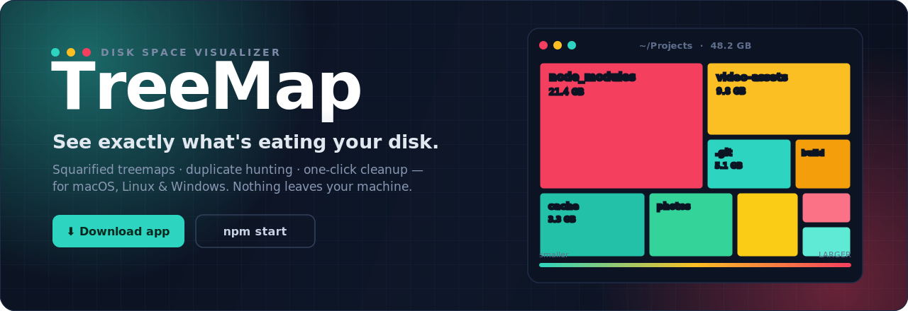
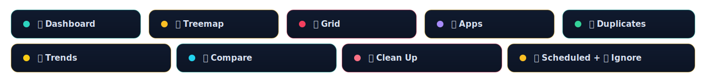

<!-- ░░░░░░░░░░░░░░░░░░░░░░░░░░░  TREEMAP  ░░░░░░░░░░░░░░░░░░░░░░░░░░░ -->

<div align="center">

<a href="https://github.com/Prithvi-Web/TreeMap-Disk-Visualizer/releases">
  
</a>

<br><br>

<!-- primary CTAs -->
<a href="https://github.com/Prithvi-Web/TreeMap-Disk-Visualizer/releases"></a>&nbsp;
<a href="https://github.com/Prithvi-Web/TreeMap-Disk-Visualizer/stargazers"></a>&nbsp;
<a href="https://github.com/Prithvi-Web/TreeMap-Disk-Visualizer/fork"></a>

<br><br>

<!-- platform -->


<br><br>

<kbd><a href="#-download-the-app-for-users">⬇ Download</a></kbd> &nbsp;
<kbd><a href="#-the-eight-views">✨ Features</a></kbd> &nbsp;
<kbd><a href="#-run-from-source--web-mode-3-commands">🚀 Run it</a></kbd> &nbsp;
<kbd><a href="#-api-overview">🔌 API</a></kbd> &nbsp;
<kbd><a href="#-safety">🛡️ Safety</a></kbd>

</div>


<br>

<div align="center">
<table>
<tr>
<td align="center" width="33%">🟩&nbsp;&nbsp;<b>Find it</b><br><sub>Squarified treemap of every byte</sub></td>
<td align="center" width="33%">🟨&nbsp;&nbsp;<b>Understand it</b><br><sub>Trends, diffs & duplicate hunting</sub></td>
<td align="center" width="33%">🟥&nbsp;&nbsp;<b>Reclaim it</b><br><sub>One-click cleanup → system Trash</sub></td>
</tr>
</table>
</div>

> [!TIP]
> **No Node. No setup. No telemetry.** The desktop app is fully self-contained and scans the disk
> of the machine it runs on. Deletes always go to your **system Trash** — nothing is ever
> hard-deleted, so every action is recoverable.

<br>

## ✨ The ten views

TreeMap isn't just a treemap — it's a full disk-hygiene workbench. Ten views, one zero-dependency frontend.

<div align="center">
  
</div>

<br>

<table>
<tr>
<td width="50%" valign="top">

### 📊 Dashboard
Disk-usage ring, live scan progress, file-type donut chart, and the **top-10 largest files _and folders_**. Click a folder to leap straight into the treemap. A **disk-full forecast** projects from your scan history — *"At current growth (+5.4 GB/day), this disk is full in ~58 days — top culprits: …"* — and is honest when it can't know: too little history, erratic growth, or shrinking usage all say so instead of inventing a number. An **All Storage** strip unifies your local disk with any connected **Google Drive / Dropbox / OneDrive** — scan a cloud account into the very same treemap (**metadata only, no file contents are ever downloaded**; deletes go to the provider's own trash; duplicates/live/offload are disabled with clear notices). Opt-in and local-first: with no account connected, zero cloud code runs and nothing touches the network.

</td>
<td width="50%" valign="top">

### 🗺️ Treemap
A squarified treemap of every file, sized by bytes and colored **teal → amber → red**. Drill in, climb back with breadcrumbs + zoom-out, search with highlights (`report`, `*.zip`), pin **folder budgets** (over-budget folders get a red dashed border), and **export** the chart (PNG / SVG) or the whole scan (**CSV**, or a multi-page **PDF report**). A **time slider** appears once a folder has scan history: scrub to any past scan and watch the map morph — in the treemap *and* the sunburst — with a **diff overlay** tinting what grew green and what shrank red. And a **Live toggle** watches the scanned folder in real time: changed files pulse, regions re-flow as bytes move, and a "writing now" feed ranks the busiest paths by MB/min (auto-pauses when the disk goes quiet). **Containers are drillable**: .zip/.jar/.tar/.tar.gz/.iso (and Docker's data file, with the CLI) get a badge — click to look inside without extracting a byte, using the archive's own directory listing. Nothing inside an archive can be trashed or opened — only the archive itself.

</td>
</tr>
<tr>
<td width="50%" valign="top">

### 🔲 Grid
A size-proportional icon grid with multi-select, sorting, and virtual scrolling — buttery even on huge folders.

</td>
<td width="50%" valign="top">

### 📦 Apps
**How much disk does each application own?** Every app's total, split into **app / caches / data / logs**, with a **"Clear caches safely"** button (Trash-only, never touches your data) and click-through into the treemap. Files no app owns land in an honest "Everything else" bucket, so the totals always match the scan.

</td>
</tr>
<tr>
<td width="50%" valign="top">

### 🧬 Duplicates
Finds **true** duplicates (size + streamed SHA-256), grouped with reclaimable space per group. Auto-select keeps the newest copy of each. A **Near-Duplicate Images** tab catches resized, re-encoded and screenshot copies with a perceptual **dHash**.

</td>
<td width="50%" valign="top">

### 📈 Trends
Every scan saves a lightweight snapshot, charted over time per folder — with a clear **"what grew / what shrank since last scan"** breakdown.

</td>
</tr>
<tr>
<td width="50%" valign="top">

### 🔀 Compare
Pick any two scans of the same folder for a file-level diff: **added, removed, grew, shrank.** Subtrees collapse to one row instead of thousands.

</td>
<td width="50%" valign="top">

### 🧹 Clean Up
**Custom rules** (old / huge / by extension / duplicated), **Smart Suggestions** — sorted into **regenerable** (`node_modules`, Rust/Maven `target`, virtualenvs, build output — each shown with the command that restores it), **cache**, and **junk**, plus a per-profile **browser cache** breakdown (Chrome / Edge / Brave / Firefox / Safari) — and **Empty Folders**. Everything → Trash.

</td>
</tr>
<tr>
<td width="50%" valign="top">

### 📤 Offloaded
The third option next to *keep* and *trash*: **Offload…** copies files to another drive, **verifies every byte** (SHA-256, read back from the destination), and only then moves the originals to the Trash — never a bare move; any failure rolls back cleanly. This tab is the searchable index of everything offloaded, with per-destination totals, reveal-on-destination, and verified **Restore**. Unplugged drives show grayed out with a last-seen date.

</td>
<td width="50%" valign="top">

### ⏰ Scheduled scans + 🚫 Ignore list
Re-scan folders on a schedule with **growth-threshold alerts** and **disk-full forecast warnings** (native desktop notifications; the forecast horizon is configurable in Settings, default 30 days). Tell it what to skip with paths, names, or globs like `*.iso` and `~/projects/**/dist`.

</td>
</tr>
</table>

> **How it's built** — Node.js + **Express 5** + **TypeScript** on the backend. A single, **zero-dependency** `index.html` on the frontend: hand-coded **Canvas 2D**, no React, no D3, no Chart.js. Ships as a **web app** _and_ a downloadable **Electron desktop app** for macOS and Windows.


## ⬇️ Download the app (for users)

Grab the latest installer from the [**Releases page**](https://github.com/Prithvi-Web/TreeMap-Disk-Visualizer/releases):

<table>
<tr><th>Platform</th><th>File</th><th>How</th></tr>
<tr>
<td>🍎 <b>macOS</b></td>
<td><code>TreeMap-x.y.z-arm64.dmg</code></td>
<td>Open it, drag TreeMap to Applications, launch.</td>
</tr>
<tr>
<td>🪟 <b>Windows</b></td>
<td><code>TreeMap Setup x.y.z.exe</code></td>
<td>Run it and follow the installer.</td>
</tr>
</table>

> [!IMPORTANT]
> **First-launch security prompt.** Because the app isn't signed with a paid Apple/Microsoft
> developer certificate, your OS shows a one-time warning.
> - **macOS:** right-click the app → **Open** → **Open**
> - **Windows:** click **More info** → **Run anyway**
>
> After the first launch it opens normally.

<details>
<summary><b>🛠️ macOS says "TreeMap is damaged and can't be opened"?</b></summary>

<br>

That happens when the download's quarantine flag is still set. Clear it once, then launch normally — open **Terminal** and paste:

```bash
xattr -dr com.apple.quarantine /Applications/TreeMap.app
```

</details>

> No Node.js or setup required — the desktop app is self-contained and scans the disk of the computer it runs on.

### 🖥️ Desktop extras

- 📌 **Menu bar / tray icon** with live free-disk stats and quick actions (open app, scan home folder, quit). Close the window and TreeMap stays in the tray so scheduled scans keep running — quit from the tray menu.
- 🖱️ **Drag & drop** a folder onto the window or dock icon to scan it instantly.
- 🔄 **Auto-updates** from GitHub Releases (Windows; asks before restarting). On macOS, auto-update needs a code-signed build, so unsigned builds skip it — grab new versions from Releases.
- 🔔 **Growth alerts** from scheduled scans arrive as native notifications.


## 🚀 Run from source / web mode (3 commands)

```bash
npm install
npm run build
npm start
```

Then open **http://127.0.0.1:4280** in your browser.

> 💡 For development with auto-reload: `npm run dev`

Requires **Node.js 20+**. Trash support uses `gio` on Linux (preinstalled on GNOME/KDE), Finder via `osascript` on macOS, and the Recycle Bin via PowerShell on Windows.

### 📦 Build the desktop app

```bash
npm install
npm run app          # build + launch the desktop app locally
npm run dist:mac     # produce a macOS .dmg in release/
npm run dist:win     # produce a Windows installer in release/
```

> ⚠️ You can only build the macOS app on a Mac and the Windows app on Windows.
> To get **both** without owning both machines, use the automated release below — GitHub builds them for you.

<details>
<summary><b>🤖 Publish a new version (automated GitHub Actions)</b></summary>

<br>

A workflow (`.github/workflows/release.yml`) builds the macOS **and** Windows installers on GitHub's servers and attaches them to a Release — including the `latest*.yml` metadata the in-app auto-updater checks.

**To cut a release:**

1. Bump the `version` in `package.json` (e.g. `1.2.1`).
2. Create a matching **tag** prefixed with `v` (e.g. `v1.2.1`) and push it.
   In GitHub Desktop: **Repository → Push**, then on github.com: **Releases → Draft a new release → Choose a tag →** type `v1.2.1` → **Publish**.
3. The workflow runs automatically, builds both installers, and uploads them. After a few minutes the download links appear on the Releases page.

You can also trigger a test build anytime from **Actions → Build & Release → Run workflow** (installers are saved as downloadable artifacts instead of a Release).

</details>


## 🔌 API overview

<details>
<summary><b>Click to expand the full endpoint table</b></summary>

<br>

| Endpoint | Description |
|---|---|
| `POST /api/scan` | Start scanning a folder → `{ scanId }` |
| `GET /api/scan/:id/progress` | Live scan progress (Server-Sent Events) |
| `GET /api/scan/:id/result` | Full file tree (202 while running) |
| `GET /api/scan/:id/treemap` | Pre-computed squarified treemap layout |
| `GET /api/scan/:id/stats` | Scan counters incl. engine, duration & fast-rescan cache usage |
| `GET /api/scan/:id/budgets` | Saved folder budgets cross-referenced against this scan |
| `GET /api/scan/:id/export?format=csv\|pdf` | Download the scan as CSV (files / folders) or a PDF report |
| `GET /api/scans` | Completed scans currently in memory |
| `GET /api/large-files?scanId=` | Top N largest files |
| `GET /api/large-folders?scanId=` | Top N largest folders (recursive sizes) |
| `GET /api/file-types?scanId=` | Size breakdown by extension |
| `GET /api/apps?scanId=` | Per-app storage attribution: totals, app / cache / data / logs breakdown, safe-to-clear bytes |
| `GET /api/duplicates?scanId=` | Duplicate groups (starts hashing; poll until complete) |
| `GET /api/near-duplicates?scanId=&threshold=` | Perceptual (dHash) near-duplicate image clusters |
| `GET /api/empty-folders?scanId=` | Recursively empty folders (`ignoreJunk` configurable) |
| `GET /api/compare?scanIdA=&scanIdB=` | File-level diff of two scans of the same root |
| `GET /api/snapshots` | Scan history: roots, per-root snapshots (`?path=`), or all (`?all=true`) |
| `GET /api/snapshots/compare?a=&b=` | Top-level deltas between two snapshots |
| `GET /api/snapshots/tree?path=&at=` | Historical treemap closest to a timestamp (time slider), with grew/shrank data |
| `GET /api/forecast?path=` | Disk-full projection: days until full, confidence, top growers — honest when history is thin |
| `GET /api/watch/:scanId` | Live disk activity (Server-Sent Events): per-second batches of `{ path, delta, kind }` |
| `POST /api/container/expand` | List a container's contents (zip/jar/tar/tgz/iso/docker) as virtual treemap children — never extracts |
| `POST /api/offload` · `GET /api/offload/:id/progress` | Copy → SHA-256 verify → trash originals, to another drive (SSE progress, cancellable with rollback) |
| `GET /api/offload/index` · `POST /api/offload/restore` | Searchable offload catalog (mount-aware) and verified restore |
| `GET /api/cloud/status` · `POST /api/cloud/connect` · `…/disconnect` | Cloud accounts: local-only status, PKCE OAuth (loopback + paste fallback), token wipe |
| `POST /api/cloud/scan` · `POST /api/cloud/trash` | Metadata-only cloud scan (registers like a disk scan) and provider-trash deletes — the documented pathGuard exemption |
| `GET /api/cleanup/suggestions?scanId=` | Smart cleanup suggestions (regenerable / cache / junk) |
| `GET /api/cleanup/browser-profiles?scanId=` | Per-browser-profile cache breakdown |
| `GET /api/git/repos?scanId=` · `POST /api/git/gc` | Git pack/loose/LFS breakdown, and `git gc` a scanned repo |
| `GET /api/system/snapshots` · `POST …/purge` | OS snapshot accounting (APFS / Btrfs / VSS) |
| `GET /api/settings` · `PUT /api/settings` | Ignore list, scheduled scans + folder budgets |
| `GET /api/notifications` | Growth alerts from scheduled scans |
| `GET /api/system` · `GET /api/trash/size` | Disk totals & platform; system Trash size |
| `GET /api/fs/list?path=` | Folder browser (powers the path picker) |
| `GET /api/files/preview?path=` | Quick-look preview (image / text / thumbnail) |
| `DELETE /api/files` | Move files to the system trash |
| `POST /api/files/open` | Open / reveal a path in Finder & co. |

</details>


## 🛡️ Safety

Disk tools should never lose your data. TreeMap is built defensively:

- 🔒 Paths are sanitized and traversal-proofed; system dirs (`/proc`, `/sys`, `/dev`, `/run`, `C:\Windows\System32`, …) are blocked outright.
- 🎯 Trash/open endpoints only accept paths **inside a folder you scanned** — and never paths *inside an archive* (only the archive itself can be trashed).
- ♻️ Deletes always go through the OS Trash — undo from Finder/Explorer any time.
- 📤 Offload never bare-moves: copy first, verify every byte against a SHA-256 read back from the destination, and only then trash the originals — any failure rolls back with local data untouched.
- ☁️ Cloud scanning is strictly opt-in and metadata-only: no file contents are ever downloaded, OAuth tokens live only in the local app-data folder (Disconnect wipes them), cloud deletes go to the provider's own trash, and with no account connected no cloud code path executes at all.
- 🧬 The Duplicates view refuses to trash *every* copy in a group — at least one always stays.
- 🚦 Token-bucket rate limiting (10 req/s per IP), plus graceful SIGTERM shutdown that drains live SSE streams and stops background hashing, scheduled scans & live-activity watchers.
- ⏳ Scan results live in memory only and auto-expire after 30 minutes; history snapshots and settings are small JSON files in the platform app-data folder (`~/Library/Application Support/TreeMap`, `%APPDATA%\TreeMap`, or `~/.config/treemap`).


## 🗂️ Project layout

```text
src/
  api/          Express routes (scan, files, system, insights, settings)
  services/     DiskScanner (adaptive concurrent walker), Cleaner (trash/open),
                DuplicateFinder (staged hashing), Snapshots (Trends history),
                CleanupRules (smart suggestions), AppAttribution (per-app storage),
                Forecast (disk-full projection), Watcher (live activity),
                ContainerScanner (archive drill-down), Offload (copy-verify-trash),
                cloud/ (Google Drive, Dropbox, OneDrive — OAuth + metadata scans),
                Scheduler (recurring scans), Settings, Storage (app-data JSON), DiskUsage
  models/       Shared TypeScript interfaces
  utils/        formatBytes, squarified treemap, path sanitizer, glob matcher
  middleware/   errorHandler, rateLimiter, pathGuard
  index.ts      App entrypoint + graceful shutdown
electron/
  main.js       Desktop shell: window, tray, drag-drop, notifications, auto-update
  preload.js    Context-isolated bridge for drag-drop paths & scan pushes
public/
  index.html    The entire frontend (inline CSS + JS, zero dependencies)
scripts/
  gen-tray-icon.js  One-time generator for the tray template icons
```

## 🧠 Design decisions worth knowing

- **Scan speed is a threadpool problem, not a walker problem.** Every async `lstat`/`readdir` runs on libuv's threadpool, which defaults to 4 threads — that, not the walker's concurrency, was the bottleneck. TreeMap sizes the pool to 2× cores (≤ 16) before it spins up; measured on APFS this scans ~1.6× faster, while 32 threads is *slower* than 4 (kernel metadata-lock contention). The dashboard shows which engine ran and how long the scan took.
- **Snapshots are automatic** — one is saved after every successful scan, so Trends needs zero setup. Totals + top-level entries live in `snapshots.json` (a few KB each, capped at 200 per folder); the time slider's shallow trees (≤ 3 levels, ~100 KB budget each) sit in separate per-root files so the main history file stays tiny.
- **The scheduler is a 60-second `setInterval`**, not `node-cron` — hour-level granularity doesn't justify a dependency. Schedules fire while the app runs (the desktop app keeps running in the tray).
- **Duplicate detection is staged** (size → first 64 KB hash → full SHA-256) so scans with hundreds of thousands of files finish hashing in seconds, and only true content matches are reported.
- **Compare collapses subtrees** — a deleted or added folder shows as one row, not thousands of file rows.

<br>


<div align="center">

### Found this useful?

<a href="https://github.com/Prithvi-Web/TreeMap-Disk-Visualizer/stargazers"></a>&nbsp;
<a href="https://github.com/Prithvi-Web/TreeMap-Disk-Visualizer/fork"></a>&nbsp;
<a href="https://github.com/Prithvi-Web/TreeMap-Disk-Visualizer/issues"></a>

<br><br>

**TreeMap** &nbsp;·&nbsp; built with 🟩🟨🟥 by [**Prithvi-Web**](https://github.com/Prithvi-Web)

<sub>If TreeMap freed up a few gigs for you, a ⭐ goes a long way.</sub>

</div>
