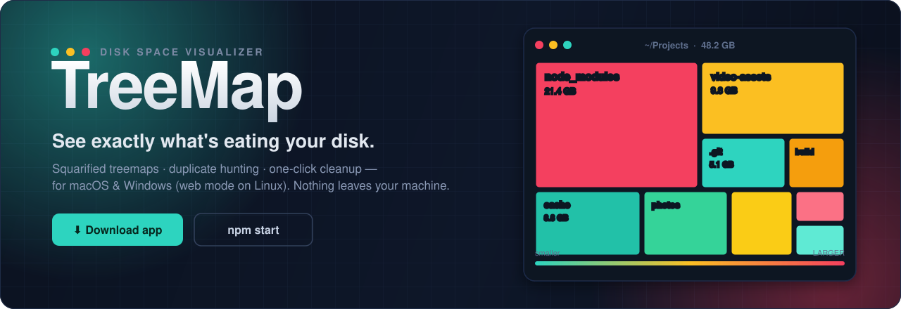
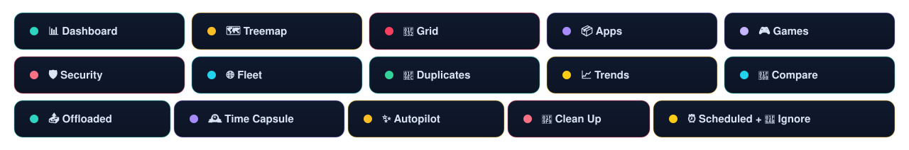

<!-- ░░░░░░░░░░░░░░░░░░░░░░░░░░░  TREEMAP  ░░░░░░░░░░░░░░░░░░░░░░░░░░░ -->

<div align="center">

<a href="https://github.com/Prithvi-Web/TreeMap-Disk-Visualizer/releases">
  
</a>

<br><br>

<!-- primary CTAs -->
<a href="https://github.com/Prithvi-Web/TreeMap-Disk-Visualizer/releases"></a>&nbsp;
<a href="https://github.com/Prithvi-Web/TreeMap-Disk-Visualizer/stargazers"></a>&nbsp;
<a href="https://github.com/Prithvi-Web/TreeMap-Disk-Visualizer/fork"></a>

<br><br>

<!-- platform -->


<br><br>

<kbd><a href="#-download-the-app-for-users">⬇ Download</a></kbd> &nbsp;
<kbd><a href="#-the-twelve-views">✨ Features</a></kbd> &nbsp;
<kbd><a href="#-run-from-source--web-mode-3-commands">🚀 Run it</a></kbd> &nbsp;
<kbd><a href="#-use-it-with-ai-mcp">🤖 AI / MCP</a></kbd> &nbsp;
<kbd><a href="#-api-overview">🔌 API</a></kbd> &nbsp;
<kbd><a href="#-safety">🛡️ Safety</a></kbd>

</div>


<br>

<div align="center">
<table>
<tr>
<td align="center" width="33%">🟩&nbsp;&nbsp;<b>Find it</b><br><sub>Squarified treemap of every byte</sub></td>
<td align="center" width="33%">🟨&nbsp;&nbsp;<b>Understand it</b><br><sub>Trends, diffs & duplicate hunting</sub></td>
<td align="center" width="33%">🟥&nbsp;&nbsp;<b>Reclaim it</b><br><sub>One-click cleanup → system Trash</sub></td>
</tr>
</table>
</div>

> [!TIP]
> **No Node. No setup. No telemetry.** The desktop app is fully self-contained and scans the disk
> of the machine it runs on. Deletes always go to your **system Trash** — nothing is ever
> hard-deleted, so every action is recoverable.

<br>

## ✨ The fifteen views

TreeMap isn't just a treemap — it's a full disk-hygiene workbench. Fifteen views, one zero-dependency frontend.

<div align="center">
  
</div>

<br>

<table>
<tr>
<td width="50%" valign="top">

### 📊 Dashboard
Disk-usage ring, live scan progress, file-type donut chart, and the **top-10 largest files _and folders_**. Click a folder to leap straight into the treemap. A **disk-full forecast** projects from your scan history — *"At current growth (+5.4 GB/day), this disk is full in ~58 days — top culprits: …"* — and is honest when it can't know: too little history, erratic growth, or shrinking usage all say so instead of inventing a number. An **All Storage** strip unifies your local disk with any connected **Google Drive / Dropbox / OneDrive** — scan a cloud account into the very same treemap (**metadata only, no file contents are ever downloaded**; deletes go to the provider's own trash; duplicates/live/offload are disabled with clear notices). Opt-in and local-first: with no account connected, zero cloud code runs and nothing touches the network.

Two more cards sit here. **Cost to Keep** prices the scanned data against Google Drive, Dropbox, OneDrive and iCloud+ — in your choice of six currencies — from a table that **ships inside the app**: TreeMap never looks prices up online, so the `as of` date is always on screen and a saving is only claimed when clearing space would actually move you down a **tier**. **Drive Health** reports the drive's own SMART attributes and self-assessment **verbatim** and answers one question — which runs out first, free space or write endurance — without ever editorialising; a false *"your drive is dying"* is a real harm, so where the numbers aren't there (no `smartctl`, or a drive that reports no wear indicator) it says exactly that instead.

**Held-Up Space** catches the disk's most confusing lie: a file you deleted whose space never came back, because a still-running program is holding the handle open. TreeMap groups those by the process holding them, biggest holder first, and offers to ask that process to quit — **gracefully only**. It refuses system PIDs, TreeMap itself and TreeMap's parent, refuses a PID whose process isn't what the caller named, and a program that declines to quit is reported as *still running* rather than force-killed. Processes it cannot see are **counted, not guessed at**.

</td>
<td width="50%" valign="top">

### 🗺️ Treemap
A squarified treemap of every file, sized by bytes and colored **teal → amber → red**. Drill in, climb back with breadcrumbs + zoom-out, search with highlights (`report`, `*.zip`), pin **folder budgets** (over-budget folders get a red dashed border), and **export** the chart (PNG / SVG) or the whole scan (**CSV**, or a multi-page **PDF report**). A **time slider** appears once a folder has scan history: scrub to any past scan and watch the map morph — in the treemap *and* the sunburst — with a **diff overlay** tinting what grew green and what shrank red. And a **Live toggle** watches the scanned folder in real time: changed files pulse, regions re-flow as bytes move, and a "writing now" feed ranks the busiest paths by MB/min (auto-pauses when the disk goes quiet). **Containers are drillable**: .zip/.jar/.tar/.tar.gz/.iso (and Docker's data file, with the CLI) get a badge — click to look inside without extracting a byte, using the archive's own directory listing. Nothing inside an archive can be trashed or opened — only the archive itself. Right-click any file for **where it came from** — the site a download originated at, read from the OS's own quarantine and "where from" metadata. Only the **host** is shown until you click to reveal the full URL, it is written with `textContent` and never as HTML, no clickable link is ever built from it, and TreeMap never fetches it: a URL out of a downloaded file is untrusted input, and it is treated that way. 

</td>
</tr>
<tr>
<td width="50%" valign="top">

### 🔲 Grid
A size-proportional icon grid with multi-select, sorting, and virtual scrolling — buttery even on huge folders.

</td>
<td width="50%" valign="top">

### 📦 Apps
**How much disk does each application own?** Every app's total, split into **app / caches / data / logs**, with a **"Clear caches safely"** button (Trash-only, never touches your data) and click-through into the treemap. Files no app owns land in an honest "Everything else" bucket, so the totals always match the scan. 

</td>
</tr>
<tr>
<td width="50%" valign="top">

### 🎮 Games
Steam, Epic, GOG and itch.io libraries, read from each launcher's own manifests (including a hand-written parser for Valve's KeyValues format), with **Steam's own reported size shown next to TreeMap's** so you can see they agree. Every title is split into **base install / shader cache / workshop content / Proton prefix / DLC** — and **only the shader cache is ever offered for removal**, because it regenerates at the cost of one stutter on next launch. The rest costs a redownload, a mod re-subscribe, or a destroyed compatibility prefix, so TreeMap won't put a checkbox next to it.

</td>
<td width="50%" valign="top">

### 🛡️ Security
Finds **keys, credentials and wallets sitting outside the folder they belong in** — a private key in `~/Downloads`, an `id_rsa` on the Desktop, a `.env` in a shared folder. It matches on **name and location only: no file is ever opened, and no file content is ever read, stored or shown**. There is **no delete button at all**. The single remedy offered is *Move to `.ssh`* (or the appropriate home), which is a **rename** — both ends must sit inside a folder you scanned, an occupied destination aborts the move, and nothing is ever removed. Findings never leave this machine, and are explicitly excluded from anything the Fleet view can share.

</td>
</tr>
<tr>
<td colspan="2" valign="top">

### 🌐 Fleet — other machines on your network
See how full your *other* computers are without walking over to them. **Off by default**, and it announces nothing until you turn it on. Machines exchange a **summary only** — the name you gave the machine and its OS, the volume's total/used/free, and the folder you last scanned with its time and size. That list is not a promise in a README, it's an **eleven-field allow-list in the code** ([`fleetSummary.ts`](src/services/fleet/fleetSummary.ts)) that is the only thing ever serialised, with a second check that throws rather than send a field whose name so much as *smells* like a file tree, a security finding or a provenance URL.

**File trees, Security findings and download origins never cross the network, and there is no remote-delete route in the server at all** — not a disabled one, not a permission-gated one; it does not exist. Asking a peer to run a scan is a *separate* opt-in that peer must grant. Pairing is a **six-digit code**, compared in constant time, good for three minutes and one machine; a wrong guess doesn't cancel the window, so nobody on the network can interrupt a pairing by guessing. The LAN listener is a **separate server with three routes** — the main API is never mounted on it and stays bound to `127.0.0.1` — and it binds your specific private IPv4 addresses, never `0.0.0.0`. Discovery is hand-written mDNS over `dgram`, no dependency added.

</td>
</tr>
<tr>
<td width="50%" valign="top">

### 🧬 Duplicates
Finds **true** duplicates (size + streamed SHA-256), grouped with reclaimable space per group. Auto-select keeps the newest copy of each. A **Near-Duplicate Images** tab catches resized, re-encoded and screenshot copies with a perceptual **dHash**.

</td>
<td width="50%" valign="top">

### 📈 Trends
Every scan saves a lightweight snapshot, charted over time per folder — with a clear **"what grew / what shrank since last scan"** breakdown.

</td>
</tr>
<tr>
<td width="50%" valign="top">

### 🔀 Compare
Pick any two scans of the same folder for a file-level diff: **added, removed, grew, shrank.** Subtrees collapse to one row instead of thousands. Every **removed** row also offers **"Check snapshots"** — your OS has probably been keeping filesystem snapshots (APFS local snapshots, Btrfs subvolumes, Volume Shadow Copies) the whole time, so a file deleted weeks ago and long gone from the Trash is often still recoverable. Looking costs nothing and asks for nothing; recovering asks for your administrator password once, at that moment, on macOS and Windows (Linux needs none). The recovered copy is written **beside** the original, never over whatever is there now — it came from an older snapshot, so overwriting by default would replace newer work with older.

</td>
<td width="50%" valign="top">

### 🧹 Clean Up
**Custom rules** (old / huge / by extension / duplicated), **Smart Suggestions** — sorted into **regenerable** (`node_modules`, Rust/Maven `target`, virtualenvs, build output — each shown with the command that restores it), **cache**, and **junk**, plus a per-profile **browser cache** breakdown (Chrome / Edge / Brave / Firefox / Safari) — and **Empty Folders**. Everything → Trash.

Smart Suggestions come from **versioned rule packs** ([`src/services/rulepacks/`](src/services/rulepacks/)) rather than hard-coded logic, so adding a known offender is a JSON edit. Every group has a **“why is this suggested”** panel showing what matched, how confident the rule is, and how to put it back. A few of the biggest things on a disk — a Docker/WSL virtual disk, Windows.old, root-owned package caches — are listed **for their size only, with no delete option**, because the file *is* the data or the OS owns it; those show the supported way to reclaim the space instead.

**Shrink Video** re-encodes large videos to HEVC using your machine's **hardware encoder** (VideoToolbox / NVENC / QSV / AMF — never a software encode that would run for hours). This is the one lossy thing TreeMap does, so the order is the guarantee: encode beside the original → probe the result → verify it → *only then* trash the original → rename → restore timestamps. If any step fails the original is still sitting there untouched. Where `ffmpeg` isn't installed the panel says so plainly and offers nothing.

**Package orphans** sorts package-manager artifacts into **orphaned** (the project that owned them is gone, so nothing will ever rebuild them), **active** (context only) and **shared cache** (always reclaimable), each with the command that restores or clears it. It **refuses to guess**: with the owning manifest missing, a directory is only claimed when one of the rule's `evidence` children is actually present — an unidentifiable folder is reported as nothing rather than as garbage.

</td>
</tr>
<tr>
<td width="50%" valign="top">

### 📤 Offloaded
The third option next to *keep* and *trash*: **Offload…** copies files to another drive, **verifies every byte** (SHA-256, read back from the destination), and only then moves the originals to the Trash — never a bare move; any failure rolls back cleanly. This tab is the searchable index of everything offloaded, with per-destination totals, reveal-on-destination, and verified **Restore**. Unplugged drives show grayed out with a last-seen date.

</td>
<td width="50%" valign="top">

### 🕰️ Time Capsule
The safety net for deletions **you didn't watch happen**. Before TreeMap ever deletes something automatically, it copies it here, **verifies every byte** (SHA-256), and only then moves the original to the Trash — so emptying the Trash doesn't lose it. Searchable and grouped by run, with one-click verified **Restore** back to the exact original path (never overwriting anything that's there now). It can't fill your disk: a size cap (default 10%) evicts the oldest copies first, and anything too big to protect is **left undeleted rather than deleted unprotected** — with the reason shown, never hidden in a log. Copies are kept 30 days by default; both numbers are in Settings. Files *you* delete go to the Trash as usual and aren't copied here.

</td>
</tr>
<tr>
<td width="50%" valign="top">

### ✨ Autopilot
**Clean Up, but it keeps happening.** Write a policy once — *"clear old build folders in ~/Projects"* — and TreeMap carries it out on its own. Every rail §B1 asks for is here and visible in the editor: **the first run of any new policy is always a preview**, showing exactly what it matched, and it deletes nothing until you approve it; **byte caps** per run and per rolling week; a **cooldown** that doubles as the schedule; and *"ask me first above N GB"* so a policy that suddenly matches far more than expected **stops instead of executing**. Everything it removes goes through the Time Capsule first, so **any run can be undone in one click**, and the run history shows what each run deleted *and why* — or the reason it decided not to. Clean Up stays exactly as it was: manual, for deleting something right now.

</td>
<td width="50%" valign="top">

### ⏰ Scheduled scans + 🚫 Ignore list
Re-scan folders on a schedule with **growth-threshold alerts** and **disk-full forecast warnings** (native desktop notifications; the forecast horizon is configurable in Settings, default 30 days). Tell it what to skip with paths, names, or globs like `*.iso` and `~/projects/**/dist`.

</td>
</tr>
</table>

> **How it's built** — Node.js + **Express 5** + **TypeScript** on the backend. A single, **zero-dependency** `index.html` on the frontend: hand-coded **Canvas 2D**, no React, no D3, no Chart.js. Navigation is a **liquid-glass sidebar** that collapses to a 64-px icon rail with ⌘B (and floats over the content, with a scrim, on narrow windows). Ships as a **web app** _and_ a downloadable **Electron desktop app** for macOS and Windows.


## ⬇️ Download the app (for users)

Grab the latest installer from the [**Releases page**](https://github.com/Prithvi-Web/TreeMap-Disk-Visualizer/releases):

<table>
<tr><th>Platform</th><th>File</th><th>How</th></tr>
<tr>
<td>🍎 <b>macOS</b></td>
<td><code>TreeMap-x.y.z-arm64.dmg</code></td>
<td>Open it, drag TreeMap to Applications, launch.</td>
</tr>
<tr>
<td>🪟 <b>Windows</b></td>
<td><code>TreeMap-Setup-x.y.z.exe</code></td>
<td>Run it and follow the installer.</td>
</tr>
</table>

> [!IMPORTANT]
> **First-launch security prompt.** Because the app isn't signed with a paid Apple/Microsoft
> developer certificate, your OS shows a one-time warning.
> - **macOS:** right-click the app → **Open** → **Open**
> - **Windows:** click **More info** → **Run anyway**
>
> After the first launch it opens normally.

<details>
<summary><b>🛠️ macOS says "TreeMap is damaged and can't be opened"?</b></summary>

<br>

That happens when the download's quarantine flag is still set. Clear it once, then launch normally — open **Terminal** and paste:

```bash
xattr -dr com.apple.quarantine /Applications/TreeMap.app
```

</details>

> No Node.js or setup required — the desktop app is self-contained and scans the disk of the computer it runs on.

### 🖥️ Desktop extras

- 📌 **Menu bar / tray icon** with live free-disk stats and quick actions (open app, scan home folder, quit). Close the window and TreeMap stays in the tray so scheduled scans keep running — quit from the tray menu.
- 🖱️ **Drag & drop** a folder onto the window or dock icon to scan it instantly.
- 🔄 **Auto-updates** from GitHub Releases (Windows; asks before restarting). On macOS, auto-update needs a code-signed build, so unsigned builds skip it — grab new versions from Releases.
- 🔔 **Growth alerts** from scheduled scans arrive as native notifications.
- 🖱️ **"Scan with TreeMap" in the right-click menu** — a Finder Quick Action on macOS, a shell entry on Windows, a Nautilus script on Linux. Add or remove it from Settings; it applies to **your account only and needs no administrator rights**. TreeMap asks the OS whether it's installed every single time rather than remembering, so uninstalling TreeMap can never leave a dead menu entry behind claiming otherwise.
- 🧳 **Portable, no-trace mode** — run TreeMap from a USB stick and it writes **nothing to the host machine**: settings, index and history all live beside the executable. If the medium is read-only it goes fully **ephemeral** — memory-backed storage, an in-memory database, an audit ring buffer, and the Time Capsule switched off *with the reason shown* rather than silently. Portable builds: `npm run dist:portable-mac` / `-win` / `-linux`.


## 🧩 Inside VS Code

There is a VS Code extension in [`vscode-extension/`](vscode-extension/). It runs
TreeMap's own server and shows the visualizer in an editor tab, so you can check
what is eating your disk without leaving your work.

```bash
cd vscode-extension
npm install && npm run compile
npx @vscode/vsce package --no-dependencies   # produces a .vsix you can install
```

Then **Extensions → ⋯ → Install from VSIX…**, and run **TreeMap: Open Disk
Visualizer** from the command palette. Right-clicking any folder in the Explorer
offers **TreeMap: Scan This Workspace Folder**.

The first open clones TreeMap, installs its dependencies and builds it, under one
cancellable progress notification; later opens go straight to starting the server.
If the folder you have open *is* this repository, your working tree is used and
nothing is downloaded — and nothing fetches or resets it either.

The server always runs as a **child process on your own Node 20+**, never inside
the extension host: TreeMap loads `better-sqlite3` and `sharp`, native modules
built for standard Node, and VS Code's host is Electron with a different ABI.

## 🚀 Run from source / web mode (3 commands)

```bash
npm install
npm run build
npm start
```

Then open **http://127.0.0.1:4280** in your browser.

> 💡 For development with auto-reload: `npm run dev`

Requires **Node.js 20+**. Trash support uses `gio` on Linux (preinstalled on GNOME/KDE), Finder via `osascript` on macOS, and the Recycle Bin via PowerShell on Windows.

### 📦 Build the desktop app

```bash
npm install
npm run app          # build + launch the desktop app locally
npm run dist:mac     # produce a macOS .dmg in release/
npm run dist:win     # produce a Windows installer in release/
```

> ⚠️ You can only build the macOS app on a Mac and the Windows app on Windows.
> To get **both** without owning both machines, use the automated release below — GitHub builds them for you.

<details>
<summary><b>🤖 Publish a new version (automated GitHub Actions)</b></summary>

<br>

A workflow (`.github/workflows/release.yml`) builds the macOS **and** Windows installers on GitHub's servers and attaches them to a Release — including the `latest*.yml` metadata the in-app auto-updater checks.

**To cut a release:**

1. Bump the `version` in `package.json` (e.g. `1.2.1`).
2. Create a matching **tag** prefixed with `v` (e.g. `v1.2.1`) and push it.
   In GitHub Desktop: **Repository → Push**, then on github.com: **Releases → Draft a new release → Choose a tag →** type `v1.2.1` → **Publish**.
3. The workflow runs automatically, builds both installers, and uploads them. After a few minutes the download links appear on the Releases page.

You can also trigger a test build anytime from **Actions → Build & Release → Run workflow** (installers are saved as downloadable artifacts instead of a Release).

</details>


## 🔌 API overview

<details>
<summary><b>Click to expand the full endpoint table</b></summary>

<br>

| Endpoint | Description |
|---|---|
| `POST /api/scan` | Start scanning a folder → `{ scanId }` |
| `GET /api/scan/:id/progress` | Live scan progress (Server-Sent Events) |
| `POST /api/scan/:id/cancel` | Stop a running scan. The walker halts and a gdu subprocess is killed; `cancelled: false` means it had already finished |
| `GET /api/scan/:id/result` | Full file tree (202 while running) |
| `GET /api/scan/:id/treemap` | Pre-computed squarified treemap layout |
| `GET /api/scan/:id/stats` | Scan counters incl. engine, duration & fast-rescan cache usage |
| `GET /api/scan/:id/budgets` | Saved folder budgets cross-referenced against this scan |
| `GET /api/scan/:id/export?format=csv\|pdf` | Download the scan as CSV (files / folders) or a PDF report |
| `GET /api/scans` | Completed scans currently in memory |
| `GET /api/large-files?scanId=` | Top N largest files |
| `GET /api/large-folders?scanId=` | Top N largest folders (recursive sizes) |
| `GET /api/file-types?scanId=` | Size breakdown by extension |
| `GET /api/apps?scanId=` | Per-app storage attribution: totals, app / cache / data / logs breakdown, safe-to-clear bytes |
| `GET /api/duplicates?scanId=` | Duplicate groups (starts hashing; poll until complete) |
| `GET /api/near-duplicates?scanId=&threshold=` | Perceptual (dHash) near-duplicate image clusters |
| `GET /api/empty-folders?scanId=` | Recursively empty folders (`ignoreJunk` configurable) |
| `GET /api/compare?scanIdA=&scanIdB=` | File-level diff of two scans of the same root |
| `GET /api/snapshots` | Scan history: roots, per-root snapshots (`?path=`), or all (`?all=true`) |
| `GET /api/snapshots/compare?a=&b=` | Top-level deltas between two snapshots |
| `GET /api/snapshots/tree?path=&at=` | Historical treemap closest to a timestamp (time slider), with grew/shrank data |
| `GET /api/forecast?path=` | Disk-full projection: days until full, confidence, top growers — honest when history is thin |
| `GET /api/watch/:scanId` | Live disk activity (Server-Sent Events): per-second batches of `{ path, delta, kind }` |
| `POST /api/container/expand` | List a container's contents (zip/jar/tar/tgz/iso/docker) as virtual treemap children — never extracts |
| `POST /api/offload` · `GET /api/offload/:id/progress` | Copy → SHA-256 verify → trash originals, to another drive (SSE progress, cancellable with rollback) |
| `GET /api/offload/index` · `POST /api/offload/restore` | Searchable offload catalog (mount-aware) and verified restore |
| `GET /api/cloud/status` · `POST /api/cloud/connect` · `…/disconnect` | Cloud accounts: local-only status, PKCE OAuth (loopback + paste fallback), token wipe |
| `POST /api/cloud/scan` · `POST /api/cloud/trash` | Metadata-only cloud scan (registers like a disk scan) and provider-trash deletes — the documented pathGuard exemption |
| `GET /api/cleanup/suggestions?scanId=` | Smart cleanup suggestions (regenerable / cache / junk) |
| `GET /api/packages/orphans?scanId=` | Package-manager leftovers: orphaned / active / shared cache |
| `GET /api/games?scanId=` | Game libraries per title: base, shader cache, workshop, Proton prefix, DLC |
| `GET /api/security/findings?scanId=` | Keys and credentials sitting outside their expected folders |
| `GET /api/provenance?path=` | Where a file came from, and when it was last opened |
| `GET /api/health/smart?device=` | Drive SMART attributes next to the growth forecast |
| `GET /api/cost/estimate?scanId=` | What the data would cost to keep on each cloud provider |
| `GET /api/compression/candidates?scanId=` | Video worth re-encoding to HEVC, with estimated savings |
| `GET /api/platform/shell-integration` | The "Scan with TreeMap" right-click entry (add / remove) |
| `GET /api/platform/portable` | Whether this is a no-trace portable session |
| `GET /api/fleet` | Other TreeMaps on your network — off by default, summaries only |
| `GET /api/cleanup/browser-profiles?scanId=` | Per-browser-profile cache breakdown |
| `GET /api/git/repos?scanId=` · `POST /api/git/gc` | Git pack/loose/LFS breakdown, and `git gc` a scanned repo |
| `GET /api/system/snapshots` · `POST …/purge` | OS snapshot accounting (APFS / Btrfs / VSS) |
| `GET /api/system/snapshots/find-deleted?path=` | Which filesystem snapshots could still hold a lost path — needs no privileges |
| `POST /api/system/snapshots/restore` | Recover it, written beside the original (asks for admin on macOS/Windows) |
| `GET /api/autopilot/policies` · `PUT …` | Standing cleanup policies (re-validated on save; editing a policy's scope revokes its approval) |
| `POST /api/autopilot/simulate` | Exactly what a policy would delete — writes nothing, touches no schedule |
| `POST /api/autopilot/policies/:id/approve` | Let a policy start deleting, after its mandatory first preview |
| `GET /api/autopilot/runs` · `POST …/runs/:id/undo` | Run history, and a verified one-click undo from the Time Capsule |
| `GET /api/timecapsule` | Items copied aside before an automated delete, with capacity + history |
| `POST /api/timecapsule/:id/restore` · `DELETE /api/timecapsule/:id` | Verified restore to the original path (202 + SSE job), or forget one copy |
| `GET /api/timecapsule/jobs/:jobId/progress` | Restore progress (Server-Sent Events), cancellable |
| `GET /api/settings` · `PUT /api/settings` | Ignore list, scheduled scans + folder budgets |
| `GET /api/notifications` | Growth alerts from scheduled scans |
| `GET /api/system` · `GET /api/trash/size` | Disk totals & platform; system Trash size |
| `GET /api/fs/list?path=` | Folder browser (powers the path picker) |
| `GET /api/files/preview?path=` | Quick-look preview (image / text / thumbnail) |
| `DELETE /api/files` | Move files to the system trash |
| `POST /api/files/open` | Open / reveal a path in Finder & co. |

</details>


## 🤖 Use it with AI (MCP)

TreeMap speaks the **Model Context Protocol (MCP)** — the open standard that lets AI assistants like **Claude** use apps as tools. Connect it once and you can simply *talk to your disk*:

> *"What's eating my disk?"* &nbsp;·&nbsp; *"Find duplicates in my Downloads and clean them up"* &nbsp;·&nbsp; *"How long until this disk is full?"* &nbsp;·&nbsp; *"Move my old videos to the external drive"*

The AI does the scanning and number-crunching with TreeMap's real engine, and **every safety rule still applies**: deletes only ever go to the system Trash, destructive actions can be previewed with a dry run first, and everything is written to an audit log.

### Step 1 — One-time setup (~2 minutes)

You need [Node.js 20+](https://nodejs.org) installed. Then copy-paste this into a terminal:

```bash
git clone https://github.com/Prithvi-Web/TreeMap-Disk-Visualizer.git
cd TreeMap-Disk-Visualizer
npm install
npm run build
```

Done. Now print the folder's full location — you'll paste it in step 2 wherever you see `/PATH/TO/TreeMap-Disk-Visualizer`:

```bash
pwd
```

### Step 2 — Connect your AI app

<details>
<summary><b>🟠 Claude Desktop</b></summary>

<br>

1. Open Claude Desktop → **Settings → Developer → Edit Config**. That opens `claude_desktop_config.json`
   (macOS: `~/Library/Application Support/Claude/`, Windows: `%APPDATA%\Claude\`).
2. Add TreeMap to it (if the file already has an `mcpServers` block, just add the `"treemap"` entry inside it):

```json
{
  "mcpServers": {
    "treemap": {
      "command": "node",
      "args": ["/PATH/TO/TreeMap-Disk-Visualizer/dist/mcp/index.js"]
    }
  }
}
```

3. **Fully quit and reopen Claude Desktop.** A tools icon appears in the chat box — TreeMap's tools are listed under `treemap`.

> 🪟 **Windows:** write the path with double backslashes, e.g. `"C:\\Users\\you\\TreeMap-Disk-Visualizer\\dist\\mcp\\index.js"`.

</details>

<details>
<summary><b>⌨️ Claude Code</b></summary>

<br>

One command (swap in your real path):

```bash
claude mcp add treemap -- node /PATH/TO/TreeMap-Disk-Visualizer/dist/mcp/index.js
```

That's it — next session, ask Claude Code to scan a folder and it will pick up the TreeMap tools automatically. (`claude mcp list` shows it; `claude mcp remove treemap` undoes it.)

</details>

<details>
<summary><b>🖱️ Cursor</b></summary>

<br>

Create (or edit) `.cursor/mcp.json` in your home folder for all projects — or in a project's root for just that project — with:

```json
{
  "mcpServers": {
    "treemap": {
      "command": "node",
      "args": ["/PATH/TO/TreeMap-Disk-Visualizer/dist/mcp/index.js"]
    }
  }
}
```

Then enable it under **Settings → MCP**.

</details>

<details>
<summary><b>🧩 Any other MCP client</b></summary>

<br>

TreeMap is a standard **stdio** MCP server. Point your client at:

- **Command:** `node`
- **Arguments:** `/PATH/TO/TreeMap-Disk-Visualizer/dist/mcp/index.js`

No environment variables, ports, or API keys needed — it runs locally and talks over stdin/stdout. (Quick smoke test from the repo folder: `npm run mcp` should print `server ready on stdio`.)

</details>

### What the AI can do

Eight tools, all calling the exact same internals as the app — same validation, same safety rails:

| Tool | What it does |
|---|---|
| `scan_path` | Scan a folder → returns a `scanId` the other tools use |
| `get_largest` | The biggest files or folders in a scan |
| `find_duplicates` | True duplicates (size + SHA-256 content hashing) |
| `cleanup_suggestions` | Known-reclaimable space: caches, regenerable build folders, junk |
| `forecast` | Disk-full projection — *"full in ~58 days at current growth"* |
| `compare_scans` | What grew and what shrank between two scans |
| `offload` | Move files to another drive the safe way: copy → verify → then trash originals |
| `trash_paths` | Move files to the system Trash — never a hard delete |

### Kept safe by design

- 🎯 The AI can only touch paths **inside folders it has scanned** — scanning is what grants permission.
- 🧪 `trash_paths` and `offload` accept `dryRun: true`, returning the exact list of affected files and bytes while doing **nothing** — so the AI can show you the plan before acting.
- 📜 You can pin down what agents may ever touch with an `agent-policy.json` (allowed roots, protected paths, a per-operation byte cap) — see [AGENTS.md](AGENTS.md).
- 🧾 Every destructive request — executed, dry-run, or refused — lands in an append-only `audit.jsonl` you can review any time.

> 🤓 Prefer plain HTTP? The same power is available as a REST API with a machine-readable spec — start the server and fetch `/api/openapi.json` or `/api/capabilities`, or read [AGENTS.md](AGENTS.md), the full guide for automated agents.


## 🛡️ Safety

Disk tools should never lose your data. TreeMap is built defensively:

- 🔒 Paths are sanitized and traversal-proofed; system dirs (`/proc`, `/sys`, `/dev`, `/run`, `C:\Windows\System32`, …) are blocked outright.
- 🎯 Trash/open endpoints only accept paths **inside a folder you scanned** — and never paths *inside an archive* (only the archive itself can be trashed).
- ♻️ Deletes always go through the OS Trash — undo from Finder/Explorer any time.
- 📤 Offload never bare-moves: copy first, verify every byte against a SHA-256 read back from the destination, and only then trash the originals — any failure rolls back with local data untouched.
- ☁️ Cloud scanning is strictly opt-in and metadata-only: no file contents are ever downloaded, OAuth tokens live only in the local app-data folder (Disconnect wipes them), cloud deletes go to the provider's own trash, and with no account connected no cloud code path executes at all.
- 🧬 The Duplicates view refuses to trash *every* copy in a group — at least one always stays.
- 🚦 Token-bucket rate limiting (10 req/s per IP), plus graceful SIGTERM shutdown that drains live SSE streams and stops background hashing, scheduled scans & live-activity watchers.
- ⏳ Scan results live in memory only and auto-expire after 30 minutes; history snapshots and settings are small JSON files in the platform app-data folder (`~/Library/Application Support/TreeMap`, `%APPDATA%\TreeMap`, or `~/.config/treemap`).


## 🗂️ Project layout

```text
src/
  api/          Express routes (scan, files, system, insights, settings)
  services/     ScanStore (packed Structure-of-Arrays scan memory),
                DiskScanner (adaptive concurrent walker), Cleaner (trash/open),
                DuplicateFinder (staged hashing), Snapshots (Trends history),
                CleanupRules (smart suggestions), AppAttribution (per-app storage),
                Forecast (disk-full projection), Watcher (live activity),
                ContainerScanner (archive drill-down), Offload (copy-verify-trash),
                cloud/ (Google Drive, Dropbox, OneDrive — OAuth + metadata scans),
                Scheduler (recurring scans), Settings, Storage (app-data JSON), DiskUsage
  models/       Shared TypeScript interfaces
  utils/        formatBytes, squarified treemap, path sanitizer, glob matcher
  middleware/   errorHandler, rateLimiter, pathGuard
  index.ts      App entrypoint + graceful shutdown
electron/
  main.js       Desktop shell: window, tray, drag-drop, notifications, auto-update
  preload.js    Context-isolated bridge for drag-drop paths & scan pushes
public/
  index.html    The entire frontend (inline CSS + JS, zero dependencies)
vscode-extension/
  src/lib/      Pure decision-making (which source tree to run, what may be
                cloned, what a webview may frame) — no `vscode` import, so the
                main test suite covers it
  src/          The editor glue: progress notifications, the webview panel,
                and the child process that runs TreeMap's own server
scripts/
  gen-tray-icon.js  One-time generator for the tray template icons
```

## 🧠 Design decisions worth knowing

- **A scan lives in a packed Structure-of-Arrays store, not a tree of objects.** Every scan used to be millions of JavaScript objects (~330 bytes each, measured) — which put a hard ceiling of a few million files on what fit in RAM. The tree now lives in a handful of typed arrays (`src/services/scanStore.ts`): names in one UTF-8 pool, children as contiguous id ranges laid out breadth-first, paths reconstructed on demand instead of stored. Measured cost: **~52 bytes per file** at 1M, 5M, 20M and 40M synthetic nodes — a 40M-item scan is ~2 GB of arrays, and a 100M-item scan projects to ~5 GB, on hardware where the object tree could not have held 20M. Summing every directory size is one reverse linear pass (28 ms for 5M nodes vs 2.2 s recursive), nothing recurses on pathological depth, and the browser notices nothing: the pruned JSON the API emits is byte-identical to the old tree — a golden test replays a fixture scan against responses recorded from the pre-rewrite server and compares the raw bytes. The store is pure JS + TypedArrays — no native modules, nothing new to package. (An on-disk SQLite tier behind the same interface remains a possible future for scans that must survive restarts; the packed store is the shipping default.) The one deliberate trade: handing 250k pruned nodes to the UI rebuilds path strings the old tree kept around, ~150 ms per handover on an operation that already spends ~170 ms serializing.
- **Scan speed is a threadpool problem, not a walker problem.** Every async `lstat`/`readdir` runs on libuv's threadpool, which defaults to 4 threads — that, not the walker's concurrency, was the bottleneck. TreeMap sizes the pool to 2× cores (≤ 16) before it spins up; measured on APFS this scans ~1.6× faster, while 32 threads is *slower* than 4 (kernel metadata-lock contention). The dashboard shows which engine ran and how long the scan took.
- **The numbers, measured, with the machine's load next to them.** A throughput figure without the load it was taken under is not a claim about anything — the same code on the same tree has measured 116,793 items/s on an idle machine and ~47,000/s on a busy one. On an Apple Silicon MacBook running a normal desktop session (`load average 3.1–4.6`, i.e. *not* a quiet benchmark box): a **whole-disk scan of `/` covered 1,411,715 items in 16.4 s (~86,000 items/s)**, and a home folder of **458,661 items took 9.1 s**. The persistent index stores a node in **183 bytes on disk** (164 after compaction), and `readTree` hands the UI its 250,000-node cap in **~790 ms**. Expect better on an idle machine and worse under load; the relationships between these numbers are the stable part, not the absolute values.
- **Snapshots are automatic** — one is saved after every successful scan, so Trends needs zero setup. Totals + top-level entries live in `snapshots.json` (a few KB each, capped at 200 per folder); the time slider's shallow trees (≤ 3 levels, ~100 KB budget each) sit in separate per-root files so the main history file stays tiny.
- **The scheduler is a 60-second `setInterval`**, not `node-cron` — hour-level granularity doesn't justify a dependency. Schedules fire while the app runs (the desktop app keeps running in the tray).
- **Duplicate detection is staged** (size → first 64 KB hash → full SHA-256) so scans with hundreds of thousands of files finish hashing in seconds, and only true content matches are reported.
- **Compare collapses subtrees** — a deleted or added folder shows as one row, not thousands of file rows.

<br>


<div align="center">

### Found this useful?

<a href="https://github.com/Prithvi-Web/TreeMap-Disk-Visualizer/stargazers"></a>&nbsp;
<a href="https://github.com/Prithvi-Web/TreeMap-Disk-Visualizer/fork"></a>&nbsp;
<a href="https://github.com/Prithvi-Web/TreeMap-Disk-Visualizer/issues"></a>

<br><br>

**TreeMap** &nbsp;·&nbsp; built with 🟩🟨🟥 by [**Prithvi-Web**](https://github.com/Prithvi-Web)

<sub>If TreeMap freed up a few gigs for you, a ⭐ goes a long way.</sub>

</div>
